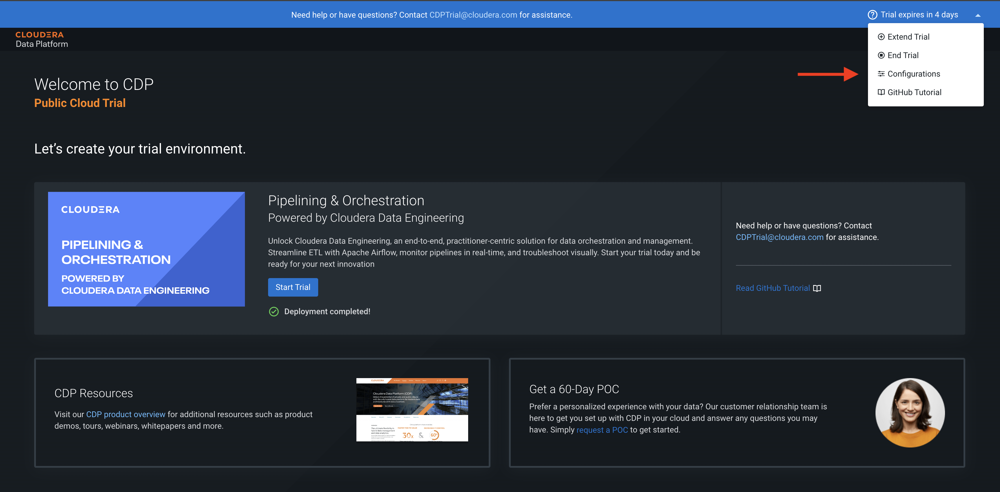
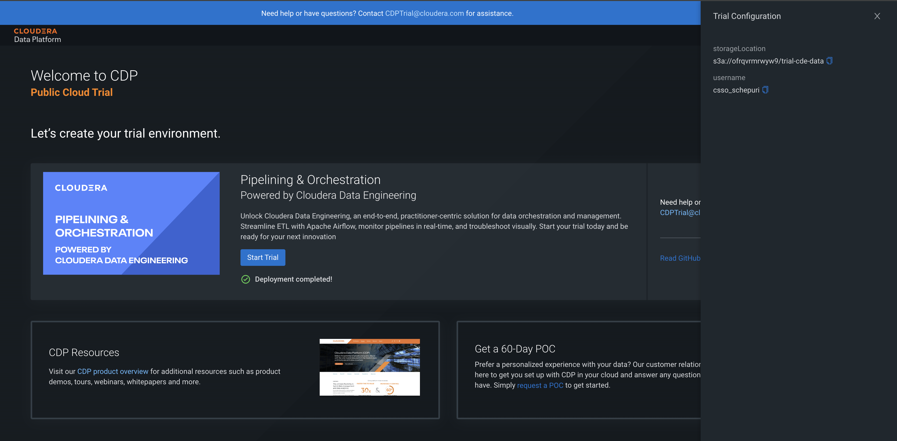
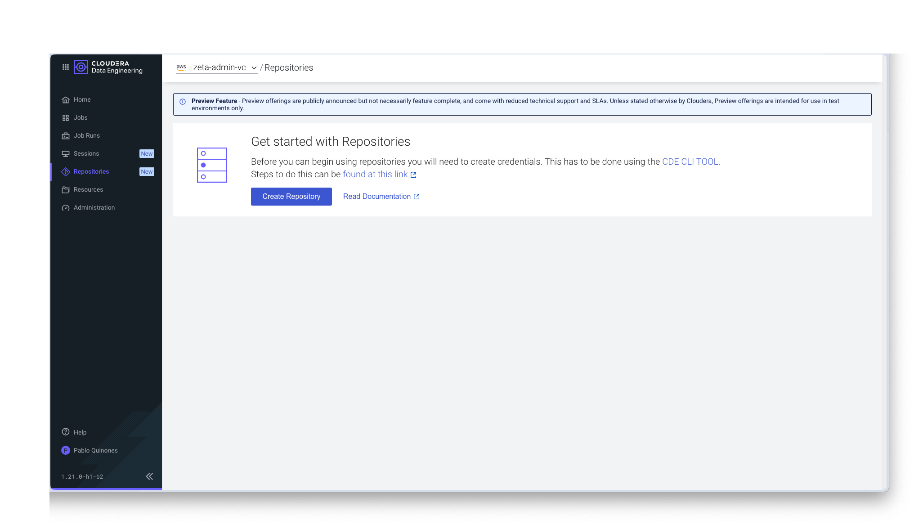
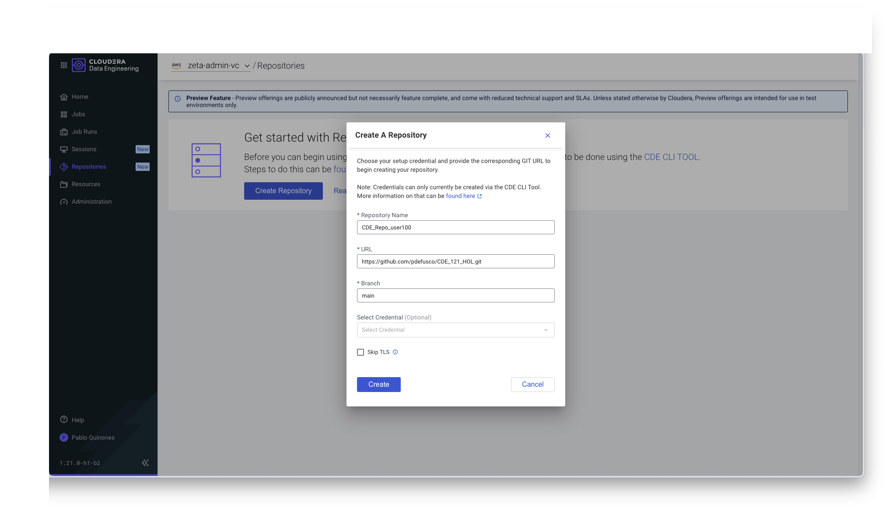
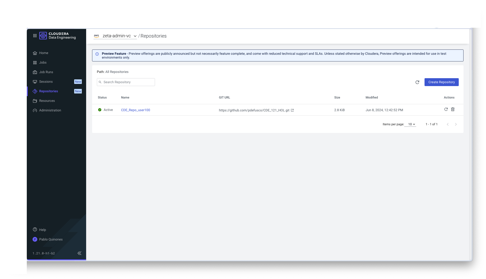
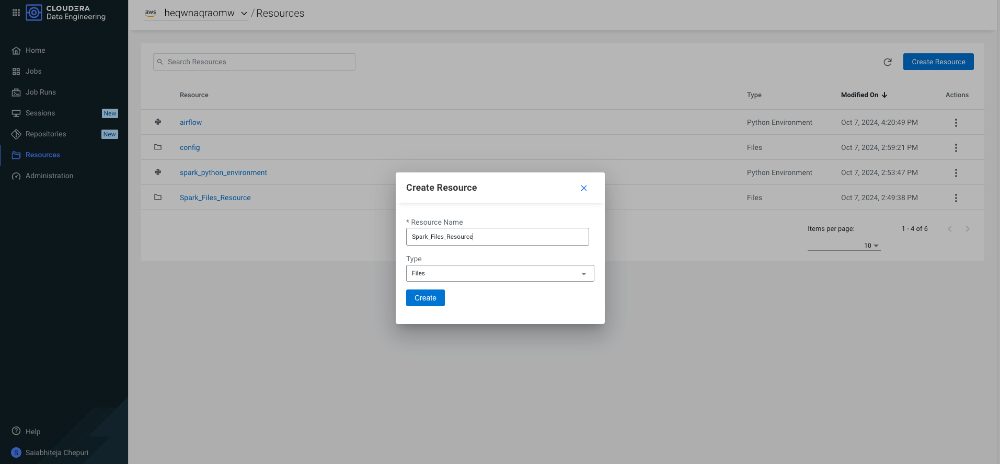
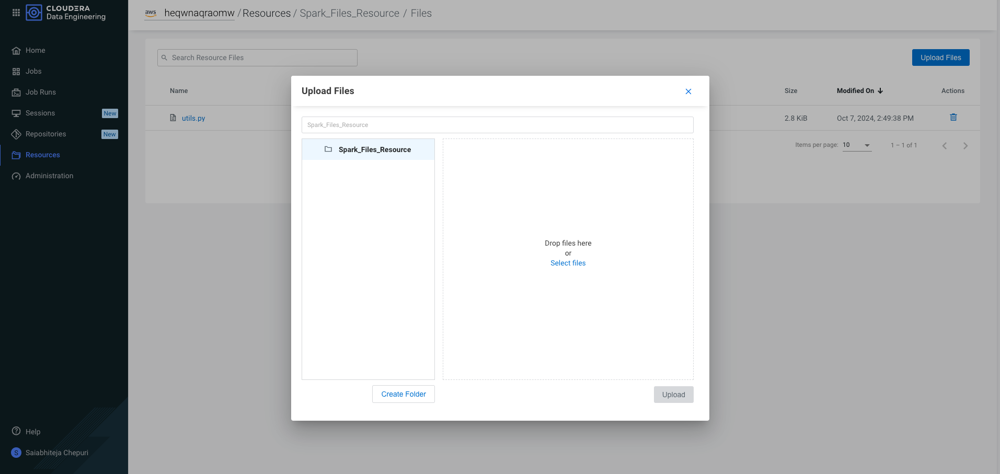
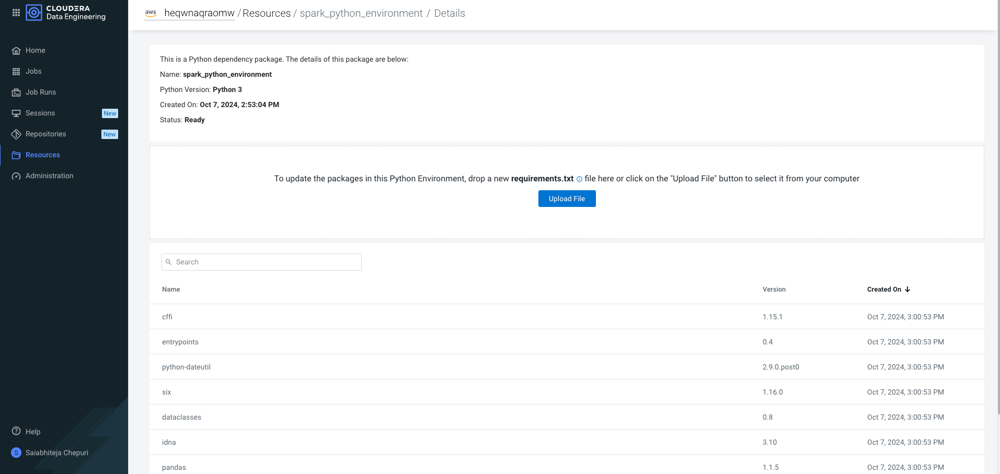

# CDE-Prerequisites

---
## **Create CDE Resources**
#### Download or Clone the Repository

To get started with the project, download or clone or fork the repository using the following command:

```bash
git clone https://github.com/cloudera/cdp-trial-patterns
```

#### Configuration Changes

After cloning the repository, you will need to modify some configuration files to integrate with your trial setup.
Follow these steps:

Replace the `spark_files` [Configuration File](https://github.com/cloudera/cdp-trial-patterns/cloudera-data-engineering/cde_spark_jobs/config.py). Update the `spark_files` configuration file with the correct values for **storageLocation** and **username**. These values should be obtained from your TrialManager configuration. You can find your assigned storage location and username from the [Trial Manager homepage](https://console.us-west-1.cdp.cloudera.com/trial/#/postRegister?pattern=CDP_DATA_ENGINEERING&trial=cdp_paas).

**Note**: Please replace any periods `(.)` in the username with underscores `(_)`.
For example, if the username is `csso_trial.user`, change it to `csso_trial_user`.
If there are no periods in the username, use the same username as shown on the [Trial Manager homepage](https://console.us-west-1.cdp.cloudera.com/trial/#/postRegister?pattern=CDP_DATA_ENGINEERING&trial=cdp_paas)



Please copy and paste the values from the trial configuration.



#### Modify Airflow DAG Script:

Update the Airflow DAG [Python file](https://github.com/cloudera/cloudera-data-engineering/cde_airflow_jobs/004_airflow_dag.py) with the respective **username** from your TrialManager configuration. You can find your assigned username from the [Trial Manager homepage](https://console.us-west-1.cdp.cloudera.com/trial/#/postRegister?pattern=CDP_DATA_ENGINEERING&trial=cdp_paas).

---

## Create CDE GIT Repository

Git repositories allow teams to collaborate, manage project artifacts, and promote applications from lower to higher environments. CDE supports integration with Git providers such as GitHub, GitLab, and Bitbucket to synchronize job runs with different versions of your code.

In this step you will create a CDE Repository in order to clone the PySpark scripts containing the Application Code for your CDE Spark Job.

From the Main Page click on "Repositories" and then the "Create Repository" blue icon.



Use the following parameters for the form:

```
Repository Name: username_cde_repo ( please follow the naming convention to avoid confusion here )
URL: https://github.com/cloudera/cdp-trial-patterns ( replace with your github link here)
Branch: main (provide your branch name here)
```



All files from the git repository are now stored in CDE as a CDE Repository. Each participant will have their own CDE repository.



---

## Create CDE Files Resource

A resource in CDE is a named collection of files used by a job or a session. Resources can include application code, configuration files, custom Docker images, and Python virtual environment specifications (requirements.txt). CDE Data Engineers leverage Files Resources in order to store files and other job dependencies in CDE, and finally associate them with Job Runs.

Create a CDE Resource of type "Files" containing the "utils.py" [python](https://github.com/cloudera/cdp-trial-patterns/cloudera-data-engineering/cde_spark_jobs/utils.py) files named "Spark_Files_Resource".




---

## Create CDE Python Environment Resource

Create a CDE Resource of type "Python" built with the [requirements.txt](https://github.com/cloudera/cdp-trial-patterns/cloudera-data-engineering/cde_spark_jobs/requirements.txt) file and named "Spark_Python_Resource" . The requirements.txt includes the list of Python packages installed in it, which will be leveraged by the Job Run when it is attached to it.

For this lab we included Great Expectations, a popular Data Quality and Validation framework.

