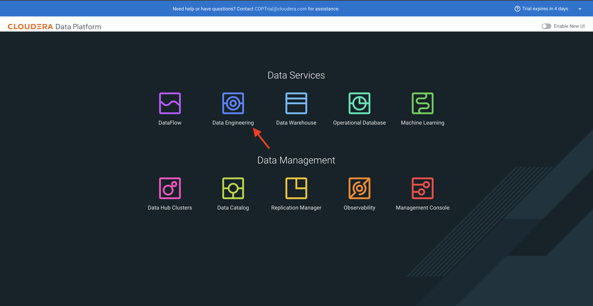
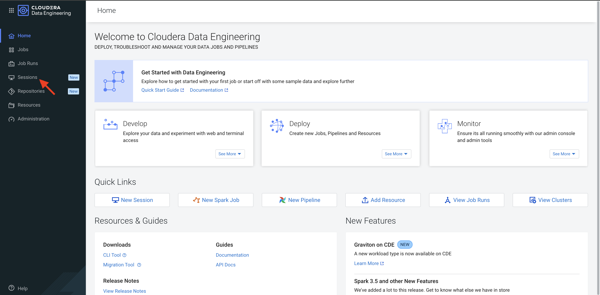
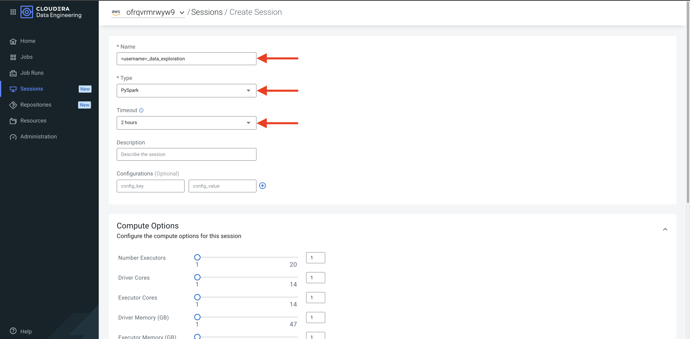
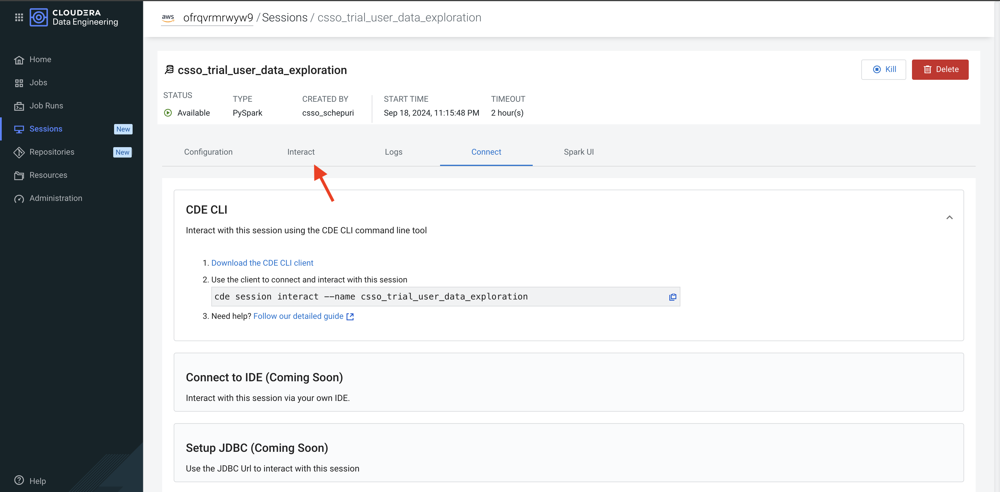

# Sessions & Apache Iceberg

---

### A Brief Introduction to Spark

Apache Spark is an open-source, distributed processing system used for big data workloads. It has gained extreme popularity as the go-to engine for interactive Data Analysis and the deployment of Production Data Engineering and Machine Learning pipelines at scale.

In CDE (Cloudera Data Engineering) you can use Spark to explore data interactively via CDE Sessions or deploy batch data engineering pipelines via CDE Jobs.

---

### Lab 1: Run PySpark Interactive Session

Navigate to the CDE Home Page



and launch a CDE PySpark Session.



Leave default settings intact.



Once the Session is ready, open the "Interact" tab in order to enter your code.



You can copy and paste code from the instructions into the notebook by clicking on the icon at the top right of the code cell.


Copy the following cell into the notebook. Before running it, ensure that you have edited the "username" variable with your assigned user.

you can find your assigned storage location and username from [Trial Manager homepage](https://console.us-west-1.cdp.cloudera.com/trial/#/postRegister?pattern=CDP_DATA_ENGINEERING&trial=cdp_paas)


please copy paste the values from trial configuration.


Copy the following cell into the notebook

```
from os.path import exists
from pyspark.sql import SparkSession
import pyspark.sql.functions as F
from pyspark.sql.types import *

storageLocation = "<paste-the-trialmanager-configuration-value here>"
username = "<paste-the-trialmanager-configuration-value here>"
```


No more code edits are required. Continue running each code snippet below in separate cells in the notebook.


```
### LOAD HISTORICAL TRANSACTIONS FILE FROM CLOUD STORAGE
transactionsDf = spark.read.json("{0}/transactions/{1}/rawtransactions".format(storageLocation, username))
transactionsDf.printSchema()
```

```
### CREATE PYTHON FUNCTION TO FLATTEN PYSPARK DATAFRAME NESTED STRUCTS
def flatten_struct(schema, prefix=""):
    result = []
    for elem in schema:
        if isinstance(elem.dataType, StructType):
            result += flatten_struct(elem.dataType, prefix + elem.name + ".")
        else:
            result.append(F.col(prefix + elem.name).alias(prefix + elem.name))
    return result
```

```
### RUN PYTHON FUNCTION TO FLATTEN NESTED STRUCTS AND VALIDATE NEW SCHEMA
transactionsDf = transactionsDf.select(flatten_struct(transactionsDf.schema))
transactionsDf.printSchema()
```

```
### RENAME COLUMNS
transactionsDf = transactionsDf.withColumnRenamed("transaction.transaction_amount", "transaction_amount")
transactionsDf = transactionsDf.withColumnRenamed("transaction.transaction_currency", "transaction_currency")
transactionsDf = transactionsDf.withColumnRenamed("transaction.transaction_type", "transaction_type")
transactionsDf = transactionsDf.withColumnRenamed("transaction_geolocation.latitude", "latitude")
transactionsDf = transactionsDf.withColumnRenamed("transaction_geolocation.longitude", "longitude")
```

```
### CAST COLUMN TYPES FROM STRING TO APPROPRIATE TYPE
transactionsDf = transactionsDf.withColumn("transaction_amount",  transactionsDf["transaction_amount"].cast('float'))
transactionsDf = transactionsDf.withColumn("latitude",  transactionsDf["latitude"].cast('float'))
transactionsDf = transactionsDf.withColumn("longitude",  transactionsDf["longitude"].cast('float'))
transactionsDf = transactionsDf.withColumn("event_ts", transactionsDf["event_ts"].cast("timestamp"))
```

```
### CALCULATE MEAN AND MEDIAN CREDIT CARD TRANSACTION AMOUNT
transactionsAmountMean = round(transactionsDf.select(F.mean("transaction_amount")).collect()[0][0],2)
transactionsAmountMedian = round(transactionsDf.stat.approxQuantile("transaction_amount", [0.5], 0.001)[0],2)

print("Transaction Amount Mean: ", transactionsAmountMean)
print("Transaction Amount Median: ", transactionsAmountMedian)
```

```
### CREATE SPARK TEMPORARY VIEW FROM DATAFRAME
transactionsDf.createOrReplaceTempView("trx")
spark.sql("SELECT * FROM trx LIMIT 10").show()
```

```
### CALCULATE AVERAGE TRANSACTION AMOUNT BY MONTH
spark.sql("SELECT MONTH(event_ts) AS month, \
          avg(transaction_amount) FROM trx GROUP BY month ORDER BY month").show()
```

```
### CALCULATE AVERAGE TRANSACTION AMOUNT BY DAY OF WEEK
spark.sql("SELECT DAYOFWEEK(event_ts) AS DAYOFWEEK, \
          avg(transaction_amount) FROM trx GROUP BY DAYOFWEEK ORDER BY DAYOFWEEK").show()
```

```
### CALCULATE NUMBER OF TRANSACTIONS BY CREDIT CARD
spark.sql("SELECT CREDIT_CARD_NUMBER, COUNT(*) AS COUNT FROM trx \
            GROUP BY CREDIT_CARD_NUMBER ORDER BY COUNT DESC LIMIT 10").show()
```

```
### LOAD CUSTOMER PII DATA FROM CLOUD STORAGE
piiDf = spark.read.options(header='True', delimiter=',').csv("{0}/pii/{1}/pii".format(storageLocation, username))
piiDf.show()
piiDf.printSchema()
```

```
### CAST LAT LON TO FLOAT TYPE AND CREATE TEMPORARY VIEW
piiDf = piiDf.withColumn("address_latitude",  piiDf["address_latitude"].cast('float'))
piiDf = piiDf.withColumn("address_longitude",  piiDf["address_longitude"].cast('float'))
piiDf.createOrReplaceTempView("cust_info")
```

```
### SELECT TOP 100 CUSTOMERS WITH MULTIPLE CREDIT CARDS SORTED BY NUMBER OF CREDIT CARDS FROM HIGHEST TO LOWEST
spark.sql("SELECT name AS name, \
          COUNT(credit_card_number) AS CC_COUNT FROM cust_info GROUP BY name ORDER BY CC_COUNT DESC \
          LIMIT 100").show()
```

```
### SELECT TOP 100 CREDIT CARDS WITH MULTIPLE NAMES SORTED FROM HIGHEST TO LOWEST
spark.sql("SELECT COUNT(name) AS NM_COUNT, \
          credit_card_number AS CC_NUM FROM cust_info GROUP BY CC_NUM ORDER BY NM_COUNT DESC \
          LIMIT 100").show()
```

```
# SELECT TOP 25 CUSTOMERS WITH MULTIPLE ADDRESSES SORTED FROM HIGHEST TO LOWEST
spark.sql("SELECT name AS name, \
          COUNT(address) AS ADD_COUNT FROM cust_info GROUP BY name ORDER BY ADD_COUNT DESC \
          LIMIT 25").show()
```

```
### JOIN DATASETS AND COMPARE CREDIT CARD OWNER COORDINATES WITH TRANSACTION COORDINATES
joinDf = spark.sql("""SELECT i.name, i.address_longitude, i.address_latitude, i.bank_country,
          r.credit_card_provider, r.event_ts, r.transaction_amount, r.longitude, r.latitude
          FROM cust_info i INNER JOIN trx r
          ON i.credit_card_number == r.credit_card_number;""")
joinDf.show()
```

```
### CREATE PYSPARK UDF TO CALCULATE DISTANCE BETWEEN TRANSACTION AND HOME LOCATIONS
distanceFunc = F.udf(lambda arr: (((arr[2]-arr[0])**2)+((arr[3]-arr[1])**2)**(1/2)), FloatType())
distanceDf = joinDf.withColumn("trx_dist_from_home", distanceFunc(F.array("latitude", "longitude",
                                                                            "address_latitude", "address_longitude")))
```

```
### SELECT CUSTOMERS WHOSE TRANSACTION OCCURRED MORE THAN 100 MILES FROM HOME
distanceDf.filter(distanceDf.trx_dist_from_home > 100).show()
```
---

### Lab 2: Using Icberg with PySpark

#### Iceberg Merge Into

**Note**: Please replace any periods `(.)` in the username with underscores `(_)`. 
For example, if the username is `csso_trial.user`, change it to `csso_trial_user`. 
If there are no periods in the username, use the same username as shown on the [Trial Manager homepage](https://console.us-west-1.cdp.cloudera.com/trial/#/postRegister?pattern=CDP_DATA_ENGINEERING&trial=cdp_paas)

Create Transactions Iceberg table:

```
#please copy the same username if there is no change in username
username_for_db = "<please check the above note and replace the username>"
```
Please verify the username, as Iceberg database naming conventions do not allow the use of a period (.) in names.
```
spark.sql("CREATE DATABASE IF NOT EXISTS SPARK_CATALOG.HOL_DB_{}".format(username_for_db))

transactionsDf.writeTo("SPARK_CATALOG.HOL_DB_{0}.TRANSACTIONS_{0}".format(username_for_db)).using("iceberg").tableProperty("write.format.default", "parquet").createOrReplace()
```

Load New Batch of Transactions in Temp View:

```
trxBatchDf = spark.read.schema("credit_card_number string, credit_card_provider string, event_ts timestamp, latitude double, longitude double, transaction_amount long, transaction_currency string, transaction_type string").json("{0}/transactions/{1}/trx_batch_1".format(storageLocation, username))
trxBatchDf.createOrReplaceTempView("trx_batch")
```

Sample Merge Into Syntax:

```
MERGE INTO prod.db.target t   -- a target table
USING (SELECT ...) s          -- the source updates
ON t.id = s.id                -- condition to find updates for target rows
WHEN MATCHED AND s.op = 'delete' THEN DELETE -- updates
WHEN MATCHED AND t.count IS NULL AND s.op = 'increment' THEN UPDATE SET t.count = 0
WHEN MATCHED AND s.op = 'increment' THEN UPDATE SET t.count = t.count + 1
WHEN NOT MATCHED THEN INSERT *
```

Run MERGE INTO in order to load new batch into Transactions table:

Spark SQL Command:

```
# PRE-MERGE COUNTS BY TRANSACTION TYPE:
spark.sql("""SELECT TRANSACTION_TYPE, COUNT(*) FROM spark_catalog.HOL_DB_{0}.TRANSACTIONS_{0} GROUP BY TRANSACTION_TYPE""".format(username_for_db)).show()

# MERGE OPERATION
spark.sql("""MERGE INTO spark_catalog.HOL_DB_{0}.TRANSACTIONS_{0} t   
USING (SELECT * FROM trx_batch) s          
ON t.credit_card_number = s.credit_card_number               
WHEN MATCHED AND t.transaction_amount < 1000 AND t.transaction_currency != "CHF" THEN UPDATE SET t.transaction_type = "invalid"
WHEN NOT MATCHED THEN INSERT *""".format(username_for_db))

# POST-MERGE COUNT:
spark.sql("""SELECT TRANSACTION_TYPE, COUNT(*) FROM spark_catalog.HOL_DB_{0}.TRANSACTIONS_{0} GROUP BY TRANSACTION_TYPE""".format(username_for_db)).show()
```

#### Iceberg Time Travel / Incremental Read

Now that you added data to the transactions table you can perform Iceberg Time Travel operations.

```
# ICEBERG TABLE HISTORY (SHOWS EACH SNAPSHOT AND TIMESTAMP)
spark.sql("SELECT * FROM spark_catalog.HOL_DB_{0}.TRANSACTIONS_{0}.history".format(username_for_db)).show()

# ICEBERG TABLE SNAPSHOTS (USEFUL FOR INCREMENTAL QUERIES AND TIME TRAVEL)
spark.sql("SELECT * FROM spark_catalog.HOL_DB_{0}.TRANSACTIONS_{0}.snapshots".format(username_for_db)).show()

# APPEND SECOND DATA BATCH
trxBatchDf = spark.read.schema("credit_card_number string, credit_card_provider string, event_ts timestamp, latitude double, longitude double, transaction_amount long, transaction_currency string, transaction_type string").json("{0}/transactions/{1}/trx_batch_2".format(storageLocation, username))
trxBatchDf.writeTo("spark_catalog.HOL_DB_{0}.TRANSACTIONS_{0}".format(username_for_db)).using("iceberg").append()

# STORE FIRST AND LAST SNAPSHOT ID'S FROM SNAPSHOTS TABLE
snapshots_df = spark.sql("SELECT * FROM spark_catalog.HOL_DB_{0}.TRANSACTIONS_{0}.snapshots;".format(username_for_db))
```

```
last_snapshot = snapshots_df.select("snapshot_id").tail(1)[0][0]
second_snapshot = snapshots_df.select("snapshot_id").collect()[1][0]

incReadDf = spark.read\
    .format("iceberg")\
    .option("start-snapshot-id", second_snapshot)\
    .option("end-snapshot-id", last_snapshot)\
    .load("spark_catalog.HOL_DB_{0}.TRANSACTIONS_{0}".format(username_for_db))

print("Incremental Report:")
incReadDf.show()
```
---

### Summary

Open data lakehouse on CDP simplifies advanced analytics on all data with a unified platform for structured and unstructured data and integrated data services to enable any analytics use case from ML, BI to stream analytics and real-time analytics. Apache Iceberg is the secret sauce of the open lakehouse.

Apache Iceberg is an open table format designed for large analytic workloads. It supports schema evolution, hidden partitioning, partition layout evolution and time travel. Every table change creates an Iceberg snapshot, this helps to resolve concurrency issues and allows readers to scan a stable table state every time.

Iceberg lends itself well to a variety of use cases including Lakehouse Analytics, Data Engineering pipelines, and regulatory compliance with specific aspects of regulations such as GDPR (General Data Protection Regulation) and CCPA (California Consumer Privacy Act) that require being able to delete customer data upon request.

CDE Virtual Clusters provide native support for Iceberg. Users can run Spark workloads and interact with their Iceberg tables via SQL statements. The Iceberg Metadata Layer tracks Iceberg table versions via Snapshots and provides Metadata Tables with snapshot and other useful information. In this Lab we used Iceberg to access the credit card transactions dataset as of a particular timestamp.

In this section you first explored two datasets interactively with CDE Interactive sessions. This feature allowed you to run ad-hoc queries on large, structured and unstructured data, and prototype Spark Application code for batch execution.

Then, you leveraged Apache Iceberg Merge Into and Time Travel in order to first efficiently upsert your data, and then query your data across the time dimension. These are just two simple examples of how Iceberg Lakehouse Analytics allow you to implement flexible data engineering pipelines.

---

### Useful Links and Resources

If you are curious to learn more about the above features in the context of more advanced use cases, please visit the following references:

* [Apache Iceberg in the Cloudera Data Platform](https://docs.cloudera.com/cdp-public-cloud/cloud/cdp-iceberg/topics/iceberg-in-cdp.html)
* [Exploring Iceberg Architecture](https://github.com/pdefusco/Exploring_Iceberg_Architecture)
* [Using Apache Iceberg in Cloudera Data Engineering](https://docs.cloudera.com/data-engineering/cloud/manage-jobs/topics/cde-using-iceberg.html)
* [Importing and Migrating Iceberg Table in Spark 3](https://docs.cloudera.com/data-engineering/cloud/manage-jobs/topics/cde-iceberg-import-migrate-table.html)
* [Getting Started with Iceberg and Spark](https://iceberg.apache.org/docs/latest/spark-getting-started/)
* [Iceberg SQL Syntax](https://iceberg.apache.org/docs/latest/spark-queries/)
